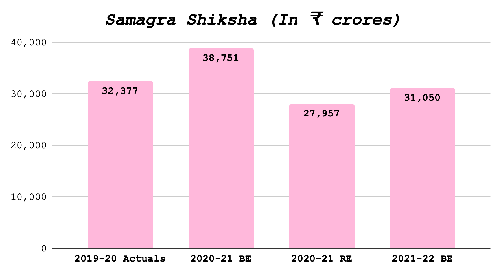

_Photo by [marif shaik](https://unsplash.com/@marif797) from [Unsplash](https://unsplash.com/)._

# COVID-19 and Education

The COVID-19 pandemic changed the education landscape of India overnight. Educational institutes were compelled to adopt various digital learning alternatives to sustain timely growth of children. In a country where only 4.4% of rural and 23.4% of urban households own computers, the challenge becomes even bigger. Moreover, this gap gets wider with only 42% of urban households having a computer with an internet connection, and the same being available to only 14.9% of rural households. [^1]

These challenges are further aggravated by the physical, psychological and sociological effects of purely online learning. [^2] Online learning has also proven to be a considerable challenge for students with disabilities. The National Education Policy 2020, taking notice of the present scenario of education in India, seeks to encourage “carefully designed and appropriately scaled pilot studies to determine how the benefits of online/digital education can be reaped while addressing or mitigating the downsides.”

# The Role of FOSS

This is where FOSS comes in, Free and Open-Source Software (FOSS) is software that is freely licensed to use, copy, study, change, improve, and redistribute. Information and communication technologies (ICTs) have the potential to improve the quality of education. However, educational institutions are often faced with financial constraints. Competing demands for resources and the high costs of ICTs can be a major obstacle to providing ICT facilities in educational institutions. FOSS has the potential to help lower the cost barrier by reducing the cost of software, which is an important component of ICT facilities. Besides the cost benefits, there are numerous other advantages in using FOSS in education, including pedagogical benefits. Education systems across states like Kerala that had adopted FOSS, benefited from a do-it-yourself and experimentation culture that was fostered by the technology. [^3]

Now more than ever before, it is important to think about Free and Open Source Software (FOSS) and education together, not as a bystander, but as an important piece to solve the education puzzle. With the pandemic accelerating the adoption of technology in the classroom, it's critical that FOSS leads the way to ensure equitable access and adoption.

> CivicDataLab recently published a report to chronicle the evolution of the FOSS ecosystem in India, identifying key stakeholders, listing out their challenges and recommendations. You can find the report at [https://state-of-foss.in/](https://state-of-foss.in/). It lays down the 4 C’s (Capacity, Consumption, Contribution and Co-creation) for each stakeholder to adopt and build a sustainable FOSS ecosystem for the country. [^4]

# Samagra Shiksha and Digital Education

In April 2018, Government of India (GoI) launched Samagra Shiksha – an Integrated Scheme for School Education, aimed at ensuring inclusive and equitable quality education from pre-primary to senior-secondary stages in accordance with the Sustainable Development Goal (SDG) for education. 

Falling under the purview of the Ministry of Education (MoE), this Centrally Sponsored Scheme subsumes three erstwhile school education schemes, namely: Sarva Shiksha Abhiyan (SSA), Rashtriya Madhyamik Shiksha Abhiyan (RMSA), and Teacher Education (TE). The scheme aims to treat school education as a continuum from pre-school to senior-secondary levels, and seeks to ensure allocative efficiency and optimal utilisation of budgetary and human resources. 

For FY 2021-22, the proposed allocation against the scheme is ₹31,050.16 crores; which though being an ~11% increase over the revised estimates of FY 2020-21 is nearly a 20% decrease over last year (FY 2020-21) budget estimates. [^5] The decrease could be a cause of concern as the challenges facing the sector have been accelerated by the pandemic and need urgent addressal. [^6] One of the focuses of the scheme is Digital Education, and Strengthening of ICT infrastructure in schools from upper primary to higher secondary level. With an increasingly digital learning environment, FOSS can play an integral role in the same.

Additionally, the Budget for the Department of Higher Education has allocated ₹645.61 Crores towards Digital India e-Learning, which is an ~111% increase over previous year’s (FY 2020-21) revised estimate, [^7] and can be employed towards further adoption of FOSS technologies in education through schemes like NMEICT and setting up of virtual classrooms and massive open online courses (MOOCs).

# The Case for Uttar Pradesh

Last year, Uttar Pradesh had allocated 13.6% of its expenditure, ₹64,805 crores for education in FY 2020-21. While being a 13.5% increase over FY 2019-20 revised allocation, this number was much lower than the average expenditure (15.9%) allocated for education by other states  when comparing 2019-20 BE. [^8] For FY 2020-21, ₹18,363 crores were allocated across the state of Uttar Pradesh for Samagra Shiksha Abhiyan with provisions under the scheme to ensure Safety and Security in Schools and Digital Education.

The Project Approval Board (PAB) of Samagra Shiksha held a meeting 14th May, 2020 to consider the Annual Work Plan & Budget (AWP&B), 2020-21 for the state of Uttar Pradesh. During the meeting following provisions were made towards Digital Education as a part of the COVID-19 response: [^9]

|  |  |  |
|------|------|------|
| DIKSHA | As per State-Specific proposal | Promotion of e-learning platform for digital teaching learning process and development of digital content |
| NISHTHA | Rs. 1000 per Resource Person/Teacher | Training of teachers on safety and e-learning aspects |
| ICT and Digital Initiatives | For schools having classes 6 to 12, a non-recurring grant of up to Rs. 6.40 lakh per school and recurring grant of upto Rs. 2.40 lakh per school per annum for a period of 5 years. | For setting up of laboratories including smart classrooms. |

If similar provisions are continued for the FY 2021-22, FOSS presents a multitude of advantages in adoption, ranging from lower cost, better ownership, privacy for child related data and setting up sustainable infrastructure for technology adoption amongst young students.

### NISHTHA
NISHTHA : National Initiative for School Heads' and Teachers' Holistic Advancement is a capacity building programme under Samagra Shiksha aimed at "Improving Quality of School Education through Integrated Teacher Training". The programme works towards building competencies among all the teachers and school principals at the elementary stage. [^10] Through this programme functionaries (at the state, district, block, cluster level) are trained on learning outcomes, school based assessment, learner – centred pedagogy, new initiatives in education, addressing diverse needs of children through multiple pedagogies, etc. This also includes, Integration of ICT in teaching, learning and assessment. Keeping in view the COVID-19 pandemic, the government has taken the State Resource Groups and Teachers training online. The programme can be used to train educators on enabling adoption of FOSS in everyday classroom resources and the structural advantages of using FOSS based technologies.

### ICT and Digital Initiatives
~90% of government schools in Uttar Pradesh are in rural areas with low penetration of smartphones and internet connectivity. Challenges like these make the transition to online education harder. The state trained 50-100 teachers in every block of Uttar Pradesh who are imparting online education through WhatsApp groups and platforms like DIKSHA, Google Bolo, Chimple, and more. [^11] For classes 6-12, ICT and Digital Initiatives grants can be utilised to set up low cost and sustainable FOSS led infrastructures across the state and use existing Ed-Tech partnerships in the state to promote the adoption of FOSS led courses, tools and technologies.

The numerous FOSS available for educational use range from Learning Management Systems to software that can be used to teach specific subjects in schools or universities. In areas where English is not used as the medium of instruction, there is also a need to translate the software into the local language. To encourage the customization, localization and development of FOSS for education, the relevant government agencies should consider establishing incentive schemes for the private sector and academic institutions to undertake these activities.

# The Road Ahead

FOSS has an important role to play in education. It can be used in setting up and running ICT infrastructure in academic institutions, meeting specialized administrative needs, and the setting up of learning management systems while lowering the costs of providing ICT facilities. The use of FOSS also makes possible improvements in teaching computer literacy, programming, software engineering and other non-IT subjects. 

The education ecosystem in India suffers from systemic challenges around access, affordability, dropouts, and outcomes and the digital divide. These challenges have been further exacerbated by the pandemic. Immediate measures need to be taken to build the human resource capacity required to implement and support FOSS and help overcome them.

#### Acknowledgments

I would like to thank [Arun Sudarsan](https://twitter.com/mrarunsudarsan), [Preethi Govindarajan](https://twitter.com/preethiellipsis) and [Upasana Hembram](https://twitter.com/watzernehm) for reviewing the work and [CivicDataLab](https://civicdatalab.in/) for publishing it.

[^1]: Key Indicators of household social consumption of education in India. NSS; http://mospi.gov.in/sites/default/files/publication_reports/KI_Education_75th_Final.pdf
[^2]: Protiva Kundu, “To No One’s Surprise, Online Schooling Has Started Taking a Psychological Toll on Students”, The Wire, July 21 2020; https://thewire.in/education/online-education-students
[^3]: Rahul De’, Lewin Siwamalai, and Ravi A Rao, “Economic Impact of Free and Open SourceSoftware Usage in Government,” June 2015; https://sflc.in/sites/default/files/wp-content/uploads/2016/06/ICFOSS_economic-impact-freev3.pdf
[^4]: The State of FOSS in India, CivicDataLab, January, 2021; https://state-of-foss.in/the-state-of-foss-report.pdf
[^5]: Union Budget 2021-22, 24-Department of School Education and Literacy; https://www.indiabudget.gov.in/doc/eb/sbe24.pdf
[^6]: Kiran Bhatty, Budget 2021 Utterly Disregards the Education Catastrophe Inflicted by COVID-19, The Wire',' https://thewire.in/education/union-budget-education
[^7]: Union Budget 2021-22, 25- Department of Higher Education; https://www.indiabudget.gov.in/doc/eb/sbe25.pdf
[^8]: PRS India, Uttar Pradesh Budget Analysis 2020-21; https://www.prsindia.org/parliamenttrack/budgets/uttar-pradesh-budget-analysis-2020-21
[^9]: Shagun Online Junction, Ministry of Education; https://seshagun.gov.in/sites/default/files/2020-10/up_pab.pdf
[^10]: National Initiative for School Heads' and Teachers' Holistic Advancement, CIET, NCERT; https://itpd.ncert.gov.in/
[^11]: Education department has converted crisis into a learning: Uttar Pradesh’s Basic Education Minister, Central Square Foundation; https://www.centralsquarefoundation.org/articles/Education-department-has-converted-crisis-into-a-learning-dr-satish-dwiwedi-Uttar-Pradesh-Basic-Education-Minister.html