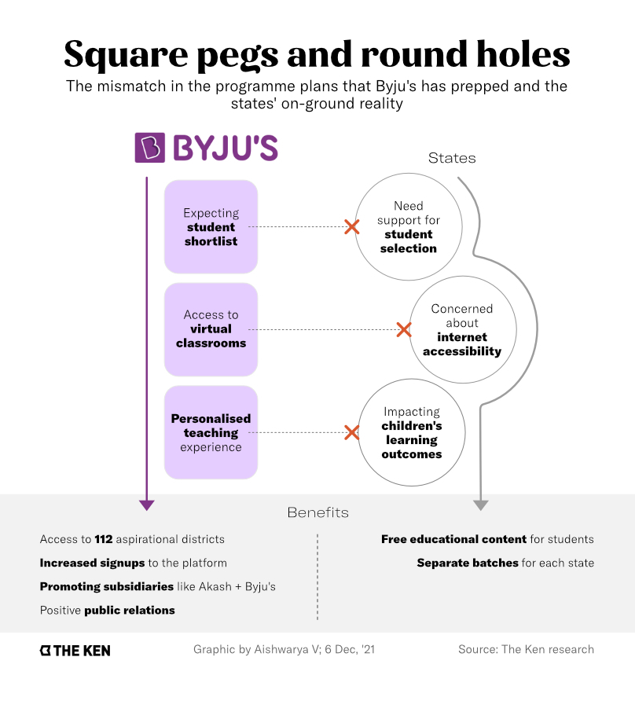

**Note**: This article was originally published on [The Ken](https://the-ken.com) website and is subject to their copyright terms and conditions.

## Summary

- The $20 billion edtech giant Byju’s has set its sight on the public education system in India. It has a willing partner in NITI Aayog

- Byju’s wants to target students in India’s most developmentally challenged states; its products aren’t a great fit for the audience

- Unwilling to customise its offering, Byju’s wants to stay away from complex on-ground operations

- This has already led to confusion with state-level functionaries, who are waiting for Byju’s to make the first move

## Graphics

## Link

You can read the full piece on The Ken's website [here](https://the-ken.com/story/up-in-the-air-the-vague-byjus-niti-aayog-stab-at-public-edtech/).
