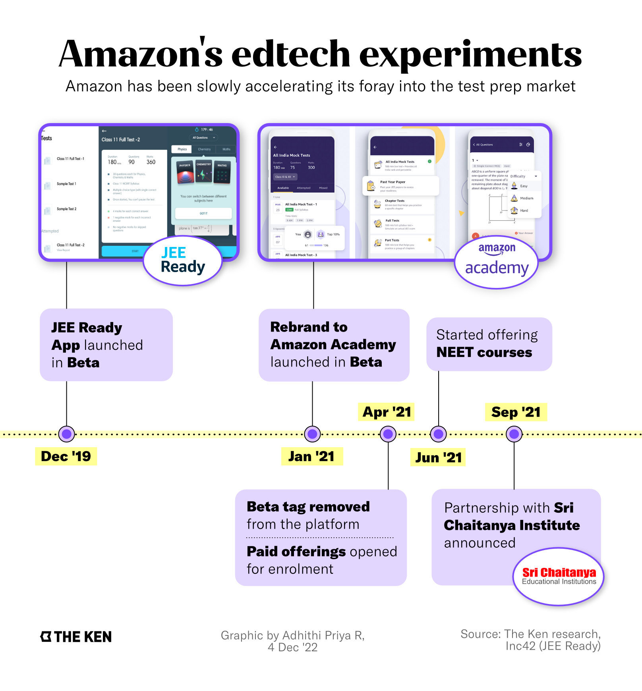
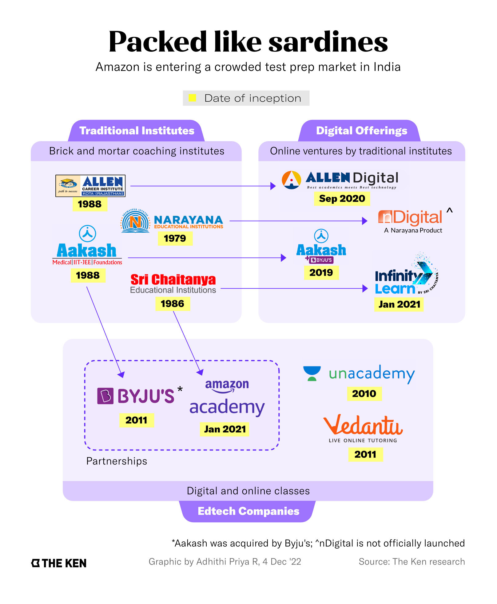

**Note**: This article was originally published on [The Ken](https://the-ken.com) website and is subject to their copyright terms and conditions.

## Summary

- Amazon is the latest edtech entrant in India, with its eye on the engineering and medical test prep market, and beyond

- The company is taking a no-frills approach to teaching and relying on data to organise, personalise, and present the content better

- To build credibility fast, Amazon Academy has partnered with Sri Chaitanya Institute and reached out to high-profile teachers

- With incumbents at large and top students still missing, Amazon will have to differentiate sufficiently to stamp its mark

## Graphics

## Link

You can read the full piece on The Ken's website [here](https://the-ken.com/story/amazons-steep-learning-curve-in-indias-crowded-online-test-prep-market/).
