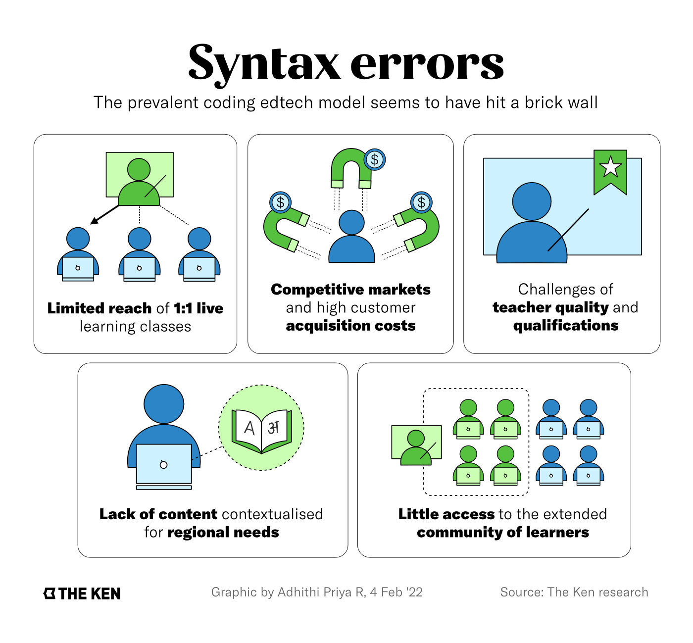
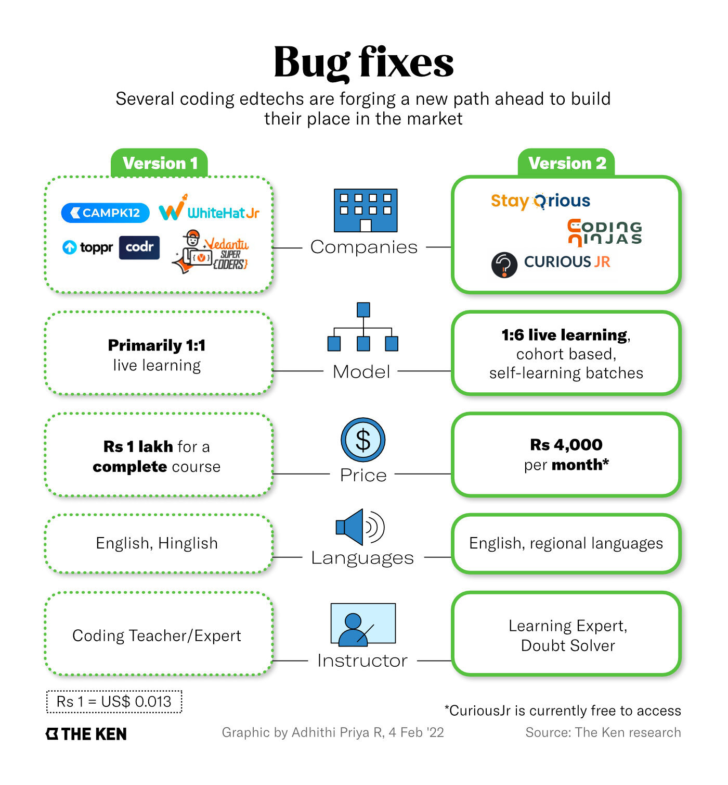

**Note**: This article was originally published on [The Ken](https://the-ken.com) website and is subject to their copyright terms and conditions.

## Summary

- Coding education in India is in the midst of a boom with the addressable market is pegged at ~20 million students

- Along with growth, challenges like homogeneity of offerings, inaccessible products, and low quality teaching have plagued the industry

- The classroom size and the role of the instructor need needs to be reevaluated for coding education to expand

- With tier-2 and above markets and institutional partnerships on the horizon, coding edtechs will have to upgrade their modus operandi

## Graphics

## Link

You can read the full piece on The Ken's website [here](https://the-ken.com/story/beyond-whitehat-jr-the-hinterland-niche-calling-indias-coding-edtechs/).
