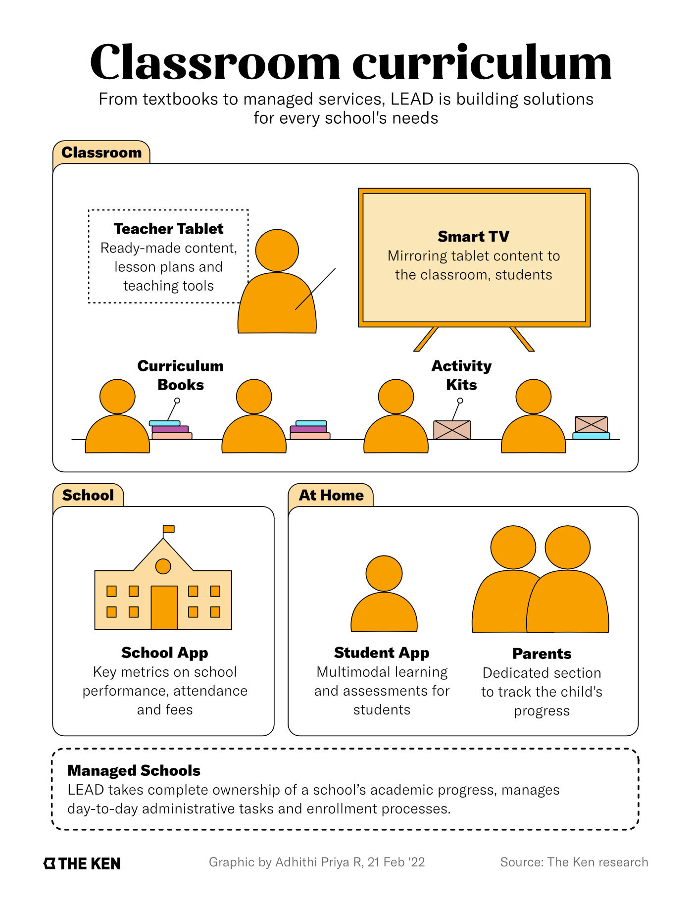
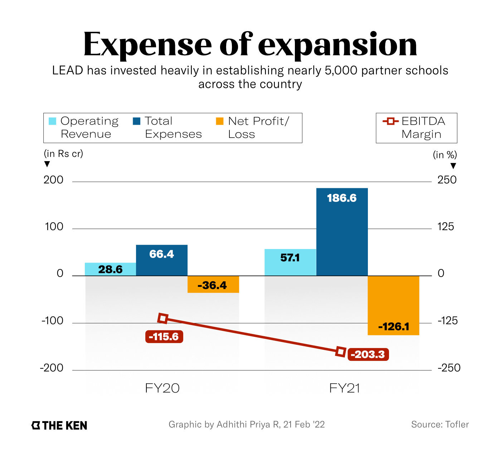

**Note**: This article was originally published on [The Ken](https://the-ken.com) website and is subject to their copyright terms and conditions.

## Summary

- In the last two years, LEAD has expanded from 600 partner schools to nearly 5,000; it raised $100 million recently, becoming a unicorn in the process

- Teachers are the centre of its plans to digitise classrooms—by removing the management and lesson planning headache, LEAD lets them focus on teaching

- LEAD’s solutions work well for splashy marketing, but they’re difficult to tailor for a diverse range of students. They’re also expensive

- The only way LEAD can make bank is by scaling; it has enough runway to hit 10,000 schools but organic growth will not come easy

## Graphics

## Link

You can read the full piece on The Ken's website [here](https://the-ken.com/story/the-speed-bumps-in-leads-plan-to-digitise-indias-budget-private-schools/).
