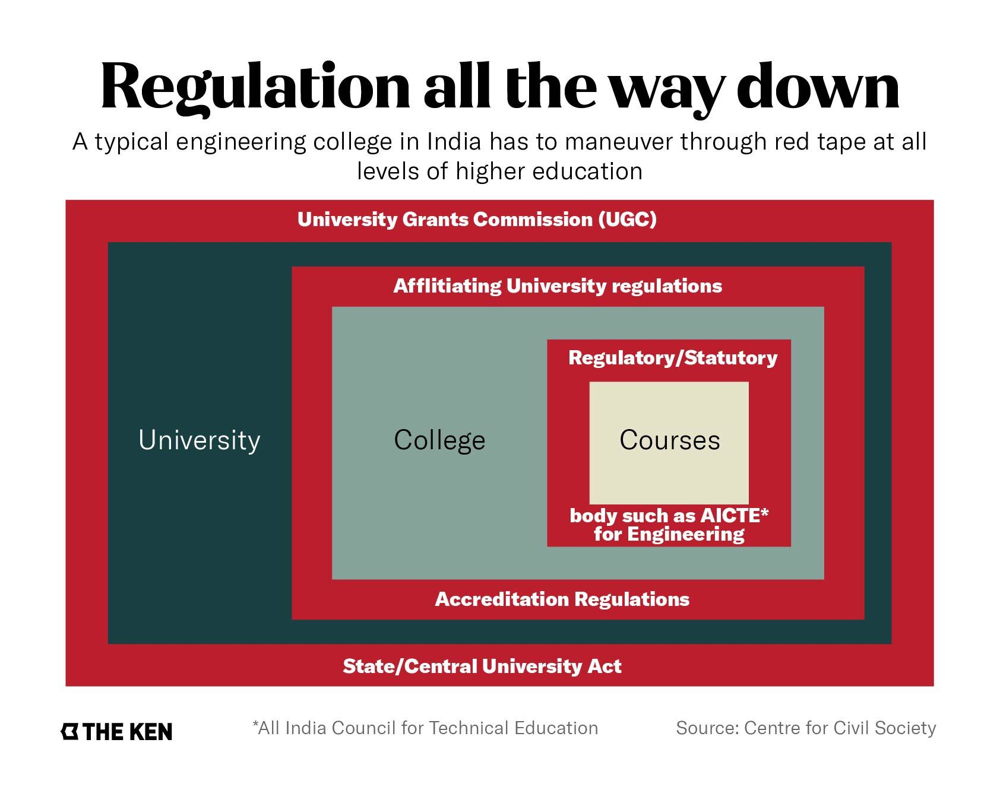
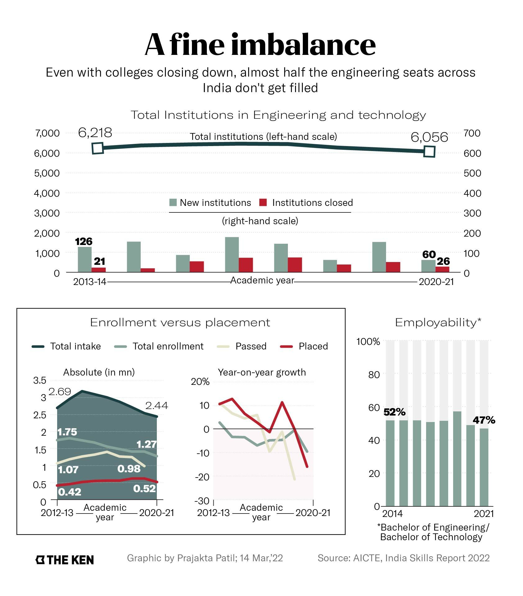

**Note**: This article was originally published on [The Ken](https://the-ken.com) website and is subject to their copyright terms and conditions.

## Summary

- Established in 1945 to improve the quality of technical education in India, AICTE’s authority has expanded, often at the expense of the autonomy of engineering colleges

- AICTE’s reach is so thorough that engineering colleges have been restricted in much of their operations from curriculum design to interdisciplinary research

- With the skills and unemployment challenges looming large, the clock is running out on India’s engineering education crisis

- The government is working on revamping the draft HECI Bill, which got its fair share of brickbats, but it may not be enough to stem the tide

## Graphics

## Link

You can read the full piece on The Ken's website [here](https://the-ken.com/story/aicte-to-heci-autonomy-india-technical-institutions/).
