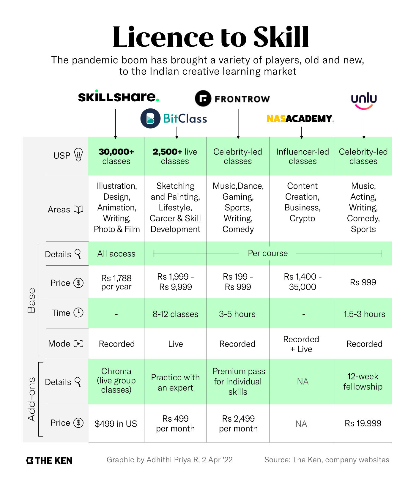

**Note**: This article was originally published on [The Ken](https://the-ken.com) website and is subject to their copyright terms and conditions.

## Summary

- Skillshare is the latest entrant in India’s creative learning market. The 12-year-old company has over 13 million registered users globally

- Skillshare is partnering with popular Indian creators like illustrator Alicia Souza, while also offering huge discounts and free trials to attract users

- Competitors like BitClass, FrontRow, and Unlu, which launched over the last two years, have already reoriented their approach to the Indian market

- To truly resonate with the Indian user, Skillshare will have to turn its skills marketplace into a community

## Graphics

## Link

You can read the full piece on The Ken's website [here](https://the-ken.com/story/community-shaped-hole-skillshare-vs-frontrow-unlu/).
