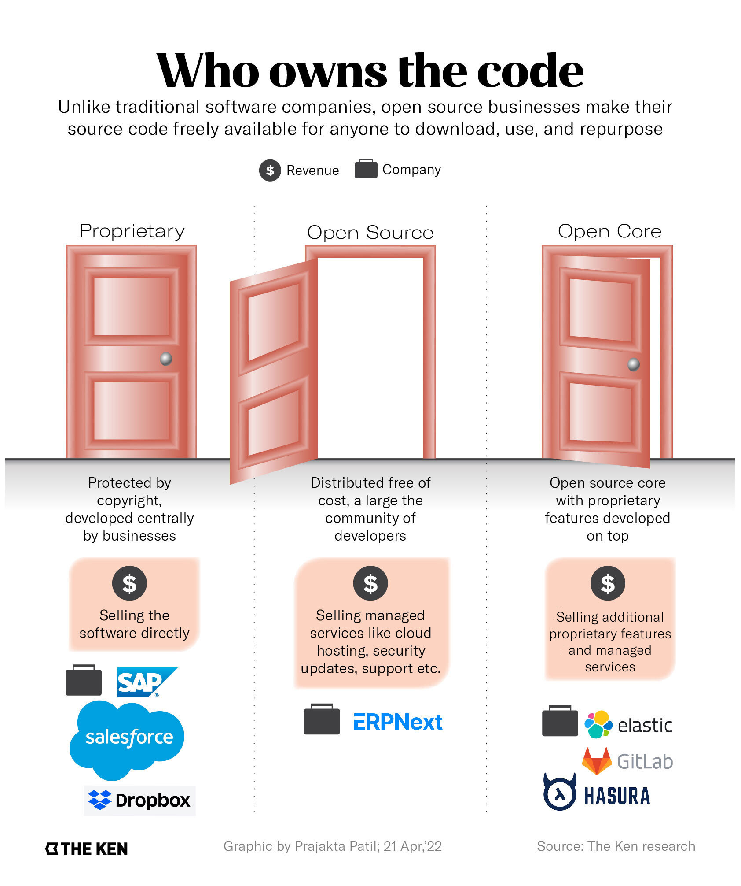
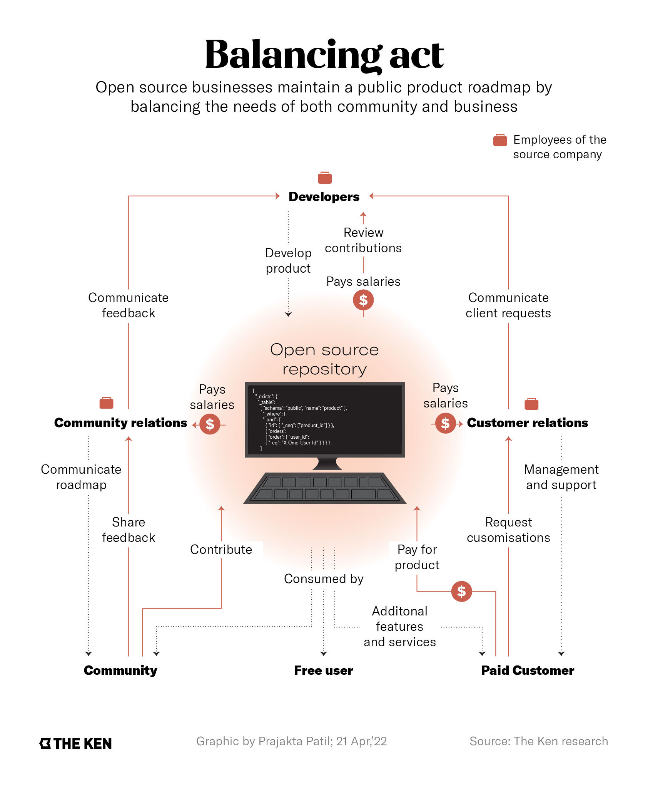

**Note**: This article was originally published on [The Ken](https://the-ken.com) website and is subject to their copyright terms and conditions.

## Summary

- In February, Hasura became the first open source business out of India to turn unicorn

- Being an open source business, the company’s core product is available for anyone to use without paying Hasura a cent

- Hasura has built a strong community of contributors that fix bugs, build new features, and even help improve the documentation

- But to succeed as an open source business, Hasura will have to serve as both an educator and a champion of the model

## Graphics

## Link

You can read the full piece on The Ken's website [here](https://the-ken.com/story/hasura-open-source-strength-commercial-weakness/).
