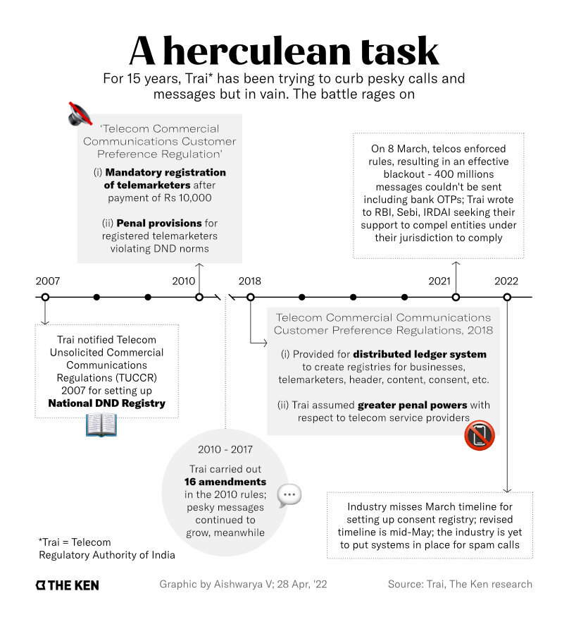
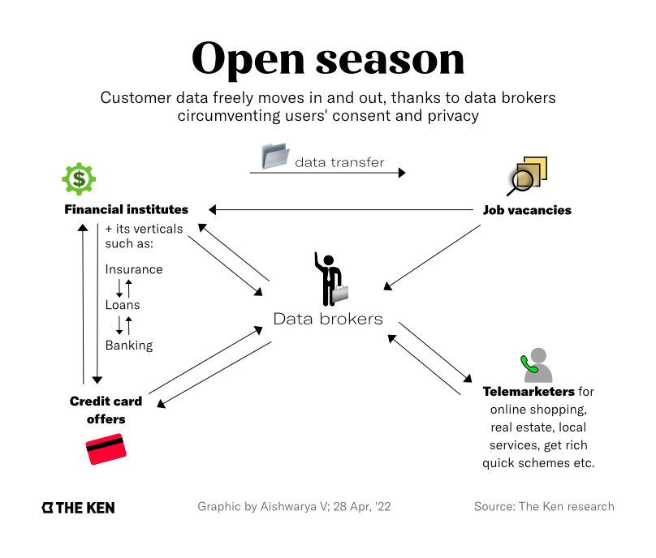

**Note**: This article was originally published on [The Ken](https://the-ken.com) website and is subject to their copyright terms and conditions.

## Summary

- Nearly 15 years after setting up the National Do Not Call Registry (NDNC), subscribers continue to be pestered by telemarketing calls

- The demand for subscriber contact details has even spawned a thriving industry of data brokers who trade subscribers’ details to telemarketers

- In 2018, Trai unveiled an ambitious framework to curb the menace via blockchain technology to curb the Rs 6,000 crore (~$783 million) industry

- The jury is still out on the impact of the new Trai framework, as consent acquisition is not a simple endeavour and telcos are dragging their feet

## Graphics

## Link

You can read the full piece on The Ken's website [here](https://the-ken.com/story/spam-gushes-through-the-cracks-in-trais-do-not-disturb-dam/).
