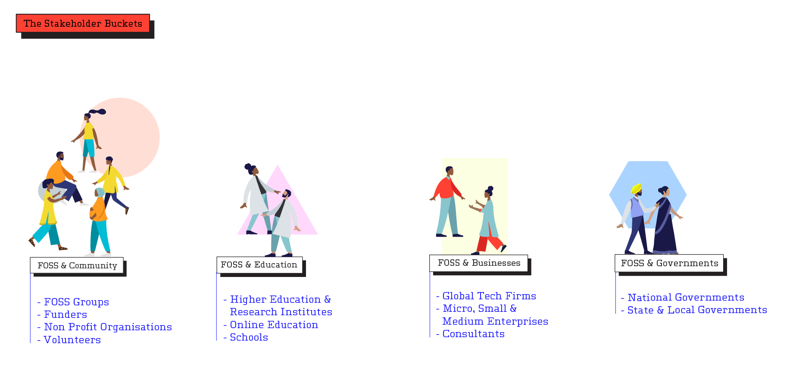
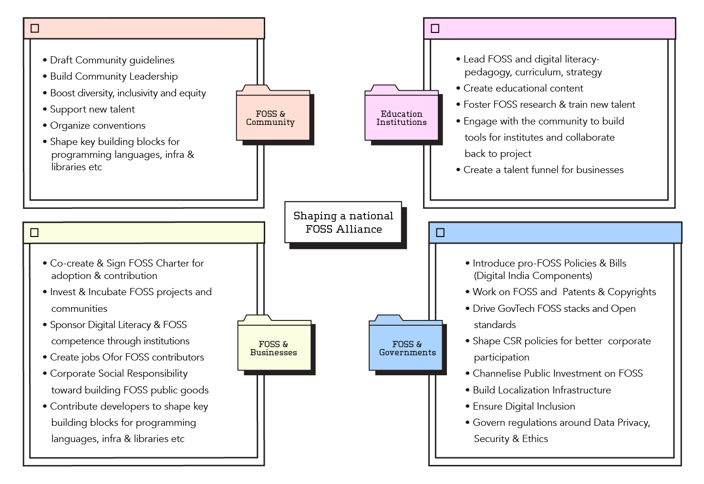
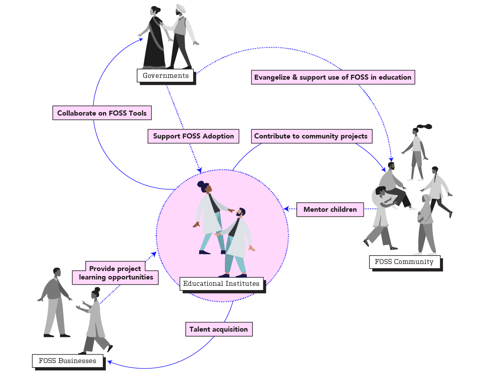

---
author:
categories:
- FOSS
- Open Source
- Report
tags:
- FOSS
- Open Source
date: "2021-02-01"
draft: false
excerpt: A chronicle of the evolution of the Free and Open Source Software (FOSS) ecosystem in India. Identifying key stakeholders, their challenges & recommendations to support the growth of a healthy community.
layout: single
links:
- icon: door-open
  icon_pack: fas
  name: website
  url: https://state-of-foss.in/
- icon: github
  icon_pack: fab
  name: code
  url: https://github.com/state-of-foss
- icon: youtube
  icon_pack: fab
  name: video
  url: https://www.youtube.com/watch?v=sJvc5qpDnX0
subtitle: A chronicle of the evolution of the Free and Open Source Software (FOSS) ecosystem in India. Identifying key stakeholders, their challenges & recommendations to support the growth of a healthy community.
title: The State of FOSS in India Report
---

### Background

[CivicDataLab](https://civicdatalab.in/) in partnership with [Omidyar Network India](https://www.omidyarnetwork.in/) conducted a research study to develop a deeper understanding of the Free & Open Source Software (FOSS) ecosystem of India, its current stakeholders, challenges faced by the FOSS movement, and explore ways to support FOSS communities and accelerate adoption in India. The research also chronicles the journey of FOSS in India, research and map out the pioneers of the FOSS movement: tracing projects, local communities, big tech contributors and current adoption by State and Central Governments.

The research identifies the key stakeholders of the ecosystem, their spheres on influence, key challenges faced by the them and recommendations on how best to support and incentivise adoption and contribution to the FOSS community, locally and globally. For the Indian FOSS ecosystem to thrive, a National FOSS Alliance is suggested — a network of committed stakeholders from developer communities, industry, academia, and government to join forces and work towards building India’s digital ecosystems rooted in the core values of FOSS.

### Team

- **_Arpit Arora_**, Co-author
- Divya Rani, Co-author, Designer
- Gaurav Godhwani, Co-author, Project Lead
- Preethi Govindarajan, Co-author

### Role

#### FOSS and Education

> 

#### Chronicle

> **Snapshot of the evolution of FOSS in India.**

### Recognition

- [India positioned to be a hub for free and open-source software: Report](https://economictimes.indiatimes.com/tech/information-tech/india-positioned-to-be-a-hub-for-free-and-open-source-software-report/articleshow/80270840.cms); Economic Times, Jan 14, 2021
- [Why India needs to fuss over FOSS](https://www.cxotoday.com/news-analysis/why-india-needs-to-fuss-over-foss/); CXOtoday.com, Jan 24, 2021
