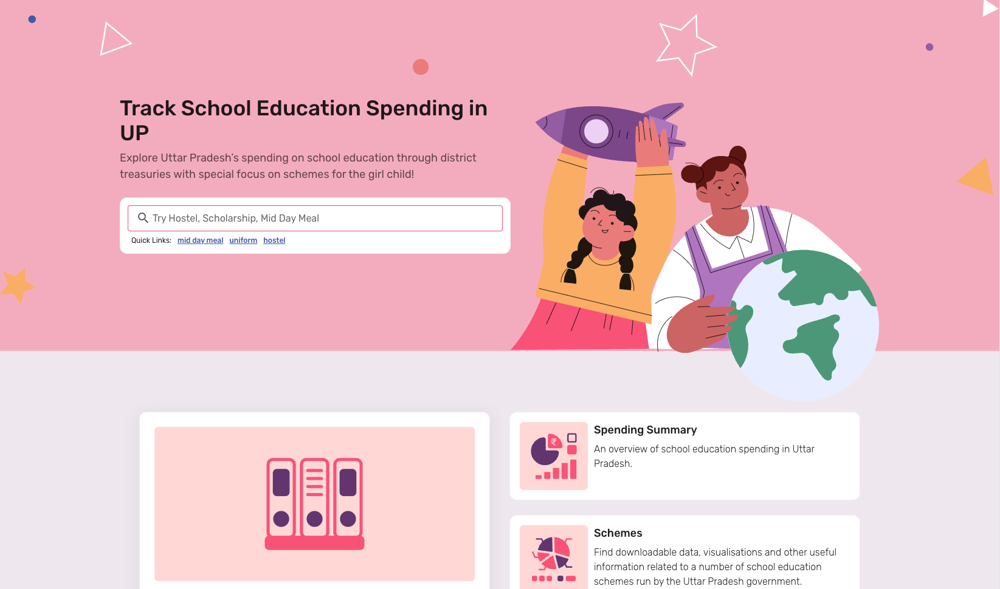

### About

[CivicDataLab](https://civicdatalab.in/) partnered with [HAQ: Centre for Child Rights](https://haqcrc.org/) (HAQ-CRC) and [Malala Fund](https://malala.org/) on a project to strengthen financial accountability towards girl education in Uttar Pradesh. The project aims at monitoring the financing of education related scheme with a special focus on promoting girl education in the state. This project will serve as a means to measure the progress towards SDG Goal 4 & 6 and will also strengthen accountability measures in public financing of education by creating a knowledge pool which will further help policy making to promote girl education.

The project also intends to build the collective voices of local CSOs to be able to advocate for greater fiscal transparency in allocation and expenditure for education related programmes by sharing the fund flow data in public domain in standardised formats. The outcomes of the proposed project are likely to improve the implementation of education related schemes in the selected states thereby benefiting all the children who are part of the schooling system.

### Solution
> **_currently under development._**

One of the key outputs of the project is the Girl Education Spending Tracker, an online interactive portal to explore the fund flow towards girl education in Uttar Pradesh with a special focus on two aspirational districts, Bahraich and Shravasti.

The portal will enable better tracking of the journey of a child’s education, enhancing the knowledge and capacity of grassroot organisations, governments and the common public at large, enabling them to make more informed decisions. It will also act as a medium of collaboration between government stakeholders and members of civil society to enable better budgetary decision making in the education sector.

**Some key features of the Girl Education Spending Tracker**:

- Overall trends of education budget and spending in Uttar Pradesh over the years.
- Details around education related spending across key accounting head, districts and DDOs.
- In-depth exploration of key schemes and accounting related to education in Uttar Pradesh.
- Access to key datasets and resources to enable further exploration of insights.
- Open Source platform with Open Data APIs, encouraging futher sharing and reuse.

### Team

- Akhil Sagiraju; Front End Developer
- **_Arpit Arora_**; Project Lead
- Jatin Baghel; Product Designer
- Shreya Agarwal; Lead Technologist
- Upasana Hembram; Advocacy Fellow

### Contributions

As a Project Lead and Lead Researcher on the project, my role encompassed the following activities on the project:

**Research**
- Exploration of the Uttar Pradesh fiscal data landscape to understand and define data scope.
- Identifying key education related accounting heads to define research boundaries.

**Development**
- Mentoring the Product Designer to translate product requirements into visual designs.
- Partnering with the development team on define product features and data models.

**Partnership**
- Communicating the progress and incorporating their aspiration in the outputs of the project.
- Capacity building sessions for partners and other CSO on key subject matter areas.

### Writings

The following research was conducted to create and published key resources for the project:

- [**Strengthening Financial Accountability towards Girl Education**](https://medium.com/civicdatalab/strengthening-financial-accountability-towards-girl-education-b9e3ba9be7d9): Exploration and analysis of the Uttar Pradesh fiscal data and education landscape.
- [**Digital Ingress & rise of Ed-Tech in the COVID-19 Era**](https://medium.com/civicdatalab/budget-ed-tech-covid-19-era-7b37afe561ee): Budget `FY 2021-22` recommendations for  the state of Uttar Pradesh on adoption of Free and Open Source Software (FOSS) to overcome education crisis due to the pandemic.
- [**Following The Education Financing Breadcrumbs**](https://medium.com/civicdatalab/following-the-education-financing-breadcrumbs-c48f803c84a1): Fiscal definition of education for the state of Uttar Pradesh to better define the scope and analyse trends.
