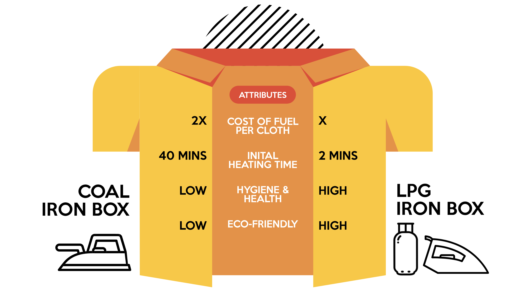

### Background

Ironing nano-entrepreneurs (vyapaaris) in India are stationed at every neighbourhood, collecting clothes from the local residents and ironing them. These vyapaaris primarily work with Coal iron boxes, where coal is the input fuel that heats the boxes. This product has not evolved in decades. The current product and market conditions make it difficult for vyapaaris to sustain and grow their businesses.

Every morning vyapaaris spend nearly 2 hours to heat up coal, taking up time to iron more clothes or earn additional income. Moreover, coal iron boxes do not have any temperature control, and coal spilling damages clothes. Added to this is the long term health impact of inhaling coal fumes. Over the last year, even coal prices have increased nearly 185%.

A suitable alternative for vyapaaris is moving to a superior product in the LPG iron box. The product drastically reduces the heating time to just 2 mins, the fuel cost per cloth ironed is also reduced by 50%. Shifting to an LPG iron box also limits the exposure to harmful carbon emissions for vyapaaris.

We work with a market transformation approach that focuses on solving three fundamental barriers around adoption of LPG iron boxes; awareness, accessibility and affordability. This model ensures that post the initial market push, intervention efforts can be dialled down and market forces take over to sustain market transformation towards the new product.

#### Impact

**Beneficiary Impact** - The LPG iron box ensures productivity increase and consequently income uplift for ironing nano-entrepreneurs. During our pilot intervention in Bangalore (India) with 1,000 ironing nano-entrepreneurs, we observed a 27% income increase, Rs. 1,150 saved on fuel per month and 133 mins time saved every day.

**Market Transformation** - Along with beneficiary impact, our work also focused on ensuring that the market sustains beyond our intervention and the LPG iron box is accessible and affordable to the ironing nano-entrepreneurs in the long term. A post intervention evaluation revealed over 37% of the market converted to LPG iron boxes. Of the 21 identified iron box retailers in Bangalore, 15 have started selling LPG iron boxes.

#### Scale

For expanding the project to new geographies, we are adopting a knowledge partner approach where it will identify new geographies and work with regional organisations who best understand the geography and local languages to implement the program. Udhyam will work with the partners to manage the progress and ensure quality. 

Udhyam also plans to publish a playbook consisting of all the processes, tools and resources under open licences, helping the local organisations to adopt these practices and guide them to execute the programme objectives. 

### Team

- **_Arpit Arora_**, Monitoring and Evaluation Specialist
- [Cyril Joseph](https://www.linkedin.com/in/cyril-joseph-33b932146/), Programme Lead
- [Juhi Yasmin](https://www.linkedin.com/in/juhi-yasmin-1878a811b/), Operations Consultant
- [Vishnu Reji](https://www.linkedin.com/in/vishnu-reji-a7820a103/), Project Associate

### Contributions

#### Monitoring and Evaluation

- Setting up the data collection methodology, infrastructure and training the team to adopt the same
- Identifying appropriate tools and technologies to setup an open source, scalable data infrastructure
- Build data management pipeline and dashboards to track the progress of the project and milestones achieved

#### Strategy and Support

- Using data to inform the strategy of the project and take key decisions around scale the programme
- Improve data literacy of team members and build solutions enable the use of data in daily operations
- Orchestrating an open knowledge approach to manage and scale the project across new geographies

### Recognition

- [How One Eco-Friendly Change Jumped Incomes From Ironing By 27% in Bengaluru](https://www.thebetterindia.com/201894/bengaluru-ironing-clothes-cost-income-system-coal-iron-press-eco-friendly/)
- [How Design Thinking Powers Micro-Entrepreneurs](https://thehardcopy.co/how-design-thinking-powers-micro-entrepreneurs/)
- [NGO helps iron wallahs migrate from coal to LPG-powered boxes](https://www.thehindu.com/news/cities/bangalore/ngo-helps-iron-wallahs-migrate-from-coal-to-lpg-powered-boxes/article37948615.ece)
