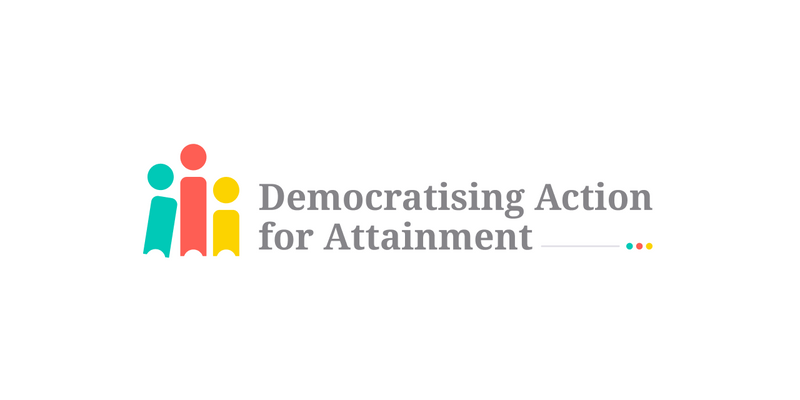

### Background

[The Northern Alliance of Scotland](https://northernalliance.scot/) is a regional improvement collaborative, spanning across and supporting eight local authorities and their associated school settings to improve education and reduce the poverty related attainment gap. Within these settings, children, young people and their families live across a diverse range of urban and rural settlements.

The aim of this collaboration is to determine what data sources and analytical techniques best reflect the challenges of child poverty, and subsequently provide a means to assess the poverty related attainment gap as a result – which will further allow individual school settings, local authorities and other bodies to plan targeted interventions to reduce it.

### Partners

Developed through the [Impact Collaborations process](https://www.dataforchildrencollaborative.com/impact-collaborations-1) by [The Data for Children Collaboratiive w/ UNICEF](https://www.dataforchildrencollaborative.com/), the project brings together academic expertise from the Fraser of Allander Institute at the [University of Strathclyde](https://www.strath.ac.uk/business/economics/fraserofallanderinstitute/) and [Glasgow Caledonian University](https://www.gcu.ac.uk/), and data science expertise at [CivicDataLab](https://civicdatalab.in/) and [East Neuk Analytics](https://eastneukanalytics.com/).

### Team

- [Akhil Sagiraju](https://www.linkedin.com/in/akhil-sagiraju/); Lead Developer
- **_Arpit Arora;_** Project Lead
- [Deepthi Chand](https://www.linkedin.com/in/deepthichand/); Technology Lead
- [Jatin Baghel](https://www.linkedin.com/in/jatinbaghel/); Product Designer
- [Nupura Gawde](https://www.linkedin.com/in/nupuragawde/); Design Researcher

### Solution

To address the complexity of the problem, research was conducted for the following threads:

- Identify and understand the various data sources and tools key stakeholders interact with, their experiences with these tools and improvements required to enable better decision making in different contexts.
- Determine what data sources, tools and techniques best reflect the challenges of child poverty, and subsequently provide a means to assess and act upon poverty related attainment gap as a result.
- Develop prototype wireframes, data models and technical architectures for the suggested solutions and collect feedback from the key stakeholders to incorporate the needs in the development plan.

### Contributions

As a Project Lead and Lead Researcher on the project, my role encompassed the following activities on the project:

- Leading the thematic research to understand the Scottish education landscape, the key stakeholders needs and the national data infrastructure to identify gaps and areas of improvements.
- Supporting the designers and technologists in translating the project requirements required outputs and working on intergrating the various outputs together into a cohesive solution.
- Liaising with the project partners, key stakeholders and Scottish government officials to communicate progress, capture feedback and onboard them as co-creators on the solution.
 
