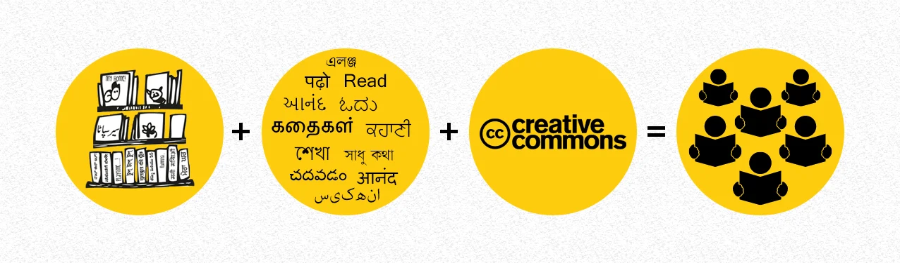

### Background

In a world where six out of every ten children are not achieving minimum proficiency in reading and mathematics, the road to literacy – and UN Sustainable Development Goal 4, quality education – is an uphill climb. And while the obstacles are many – including a shortage of schools and teachers for millions of children, compounded by a dearth of local language reading material for 40% of students – Pratham Books’ StoryWeaver is committed to providing children with the very first step to literacy acquisition. Books.

Since 2004, Pratham Books has been creating engaging storybooks in multiple languages and formats to help children discover the joy of reading – in languages they can understand, set in locations they can recognise, featuring characters with whom they can identify, and telling stories that capture their attention and fuel their imagination. Fired by our mission of ‘A book in every child’s hand’, we realised that in order to accelerate progress towards SDG 4, we need innovative solutions that bring books to children in a scalable and sustainable manner.
In 2015

In 2015, StoryWeaver was created - a new platform approach for book creation and distribution - that is taking books to some of the most disadvantaged children globally, particularly where chronic under-investment in the availability of mother tongue reading resources poses a significant barrier to literacy.

At its core, StoryWeaver is a repository of high quality, openly licensed multilingual storybooks sourced from global publishers, including but not limited to Pratham Books. Every book is freely available in multiple formats can be read online, and keeping in mind the digital divide - can also be read offline, downloaded, printed and even repurposed, so that no child is left behind. Translation and versioning tools help customize the books for localized requirements and these resources become available to other users as well, creating a multiplier effect and amplifying impact.

### Team

- **_Arpit Arora_**, Data Analyst
- [Purvi Shah](https://www.linkedin.com/in/purvi-shah-31873a5/), Director, StoryWeaver
- [Anamika Radhakrishnan](https://www.linkedin.com/in/anamika-radhakrishnan-040b1396/), Manager - Strategy and insights

### Contributions

- Leading the analytics architecture and data strategy for the open digital storybook platform, StoryWeaver.
- Analyzing the platform performance and user engagement trends to suggest enhancements to the platform.
- Building interactive dashboards for key stakeholders to explore data trends and insights across different verticals.
